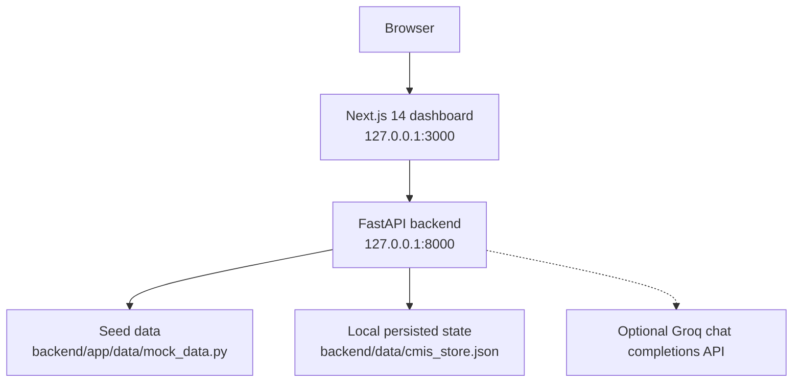

<div align="center">

# Campus Course Hub

**A local-first Course Management Information System prototype for campus transformation.**


[Quick Start](#quick-start) | [Demo Walkthrough](#demo-walkthrough) | [API Reference](#api-reference) | [Troubleshooting](#troubleshooting)

</div>

Campus Course Hub is a professor-ready Course Management Information System (CMIS) prototype built for an Organizational Transformation assignment. It demonstrates how a college can connect course registration, student progress, faculty grading, registrar operations, IT controls, analytics, certificates, and AI assistance in one coherent local application.

The project runs on a laptop with a FastAPI backend, a Next.js dashboard, seeded campus records, and optional Groq integration for live AI tutor and grading assistance. When Groq is not configured, the same flows continue with safe local fallback guidance.

## Table of Contents

- [At a Glance](#at-a-glance)
- [What This Project Shows](#what-this-project-shows)
- [Core Features](#core-features)
- [Role Workspaces](#role-workspaces)
- [Architecture](#architecture)
- [Tech Stack](#tech-stack)
- [Repository Layout](#repository-layout)
- [Prerequisites](#prerequisites)
- [Quick Start](#quick-start)
- [Configuration](#configuration)
- [Run Locally](#run-locally)
- [Demo Walkthrough](#demo-walkthrough)
- [API Reference](#api-reference)
- [Data Model and Persistence](#data-model-and-persistence)
- [AI Behavior](#ai-behavior)
- [Generated Report Artifacts](#generated-report-artifacts)
- [Development Commands](#development-commands)
- [Troubleshooting](#troubleshooting)

## At a Glance

| Area | Details |
| --- | --- |
| Product idea | A CMIS that turns course operations into a connected student, faculty, registrar, and IT experience. |
| Demo style | Local, seeded, presentation-ready, and resilient without paid cloud services. |
| Main app | Next.js role-based dashboard at `http://127.0.0.1:3000`. |
| API | FastAPI service at `http://127.0.0.1:8000` with OpenAPI docs at `/docs`. |
| AI mode | Groq-backed when `GROQ_API_KEY` is set; deterministic local fallback otherwise. |
| Persistence | Mutable demo state stored in `backend/data/cmis_store.json`. |

## What This Project Shows

This app is a compact transformation case study: it shows how a CMIS can reduce manual academic workflows, improve student visibility, support faculty decisions, give registrars operational insight, and give IT teams a clear control surface.

It is intentionally local-first so it can be demonstrated in class without paid infrastructure. The included seed data makes the dashboards meaningful as soon as the app starts.

## Core Features

- Role-based dashboard experience for Student, Teacher, Registrar, and IT Support.
- Course catalog and registration flow with active and waitlisted enrollment states.
- Student study plan, gradebook, learning rewards, and certificate verification.
- AI tutor chat scoped to the selected student's CMIS data.
- Faculty class view, grading queue, AI grading suggestions, and grade finalization.
- Registrar analytics for campus KPIs, adoption, process debt, approval routes, knowledge risk, and change rollout.
- IT dashboard for system health, free-tier dependency map, capacity monitor, API inventory, privacy controls, and audit trail.
- Seeded campus data for users, courses, enrollments, assessments, submissions, certificates, audit logs, workflows, analytics, and change-management records.
- Persistent local JSON store for user actions such as enrollments, grades, workflow actions, AI chat history, and certificate verification.
- Safe local AI fallback when `GROQ_API_KEY` is missing or the Groq API is unavailable.

## Role Workspaces

| Workspace | Primary question answered | Representative flows |
| --- | --- | --- |
| Student | What should I learn, register for, and prove next? | Study plan, course registration, tutor chat, rewards, certificates |
| Teacher | What needs review and how should feedback improve learning? | Class overview, grading queue, AI suggestion, final grade, course gaps |
| Registrar | Where is academic operations work slowing down? | KPIs, adoption heatmap, process debt, approval route, change plan |
| IT Support | Is the CMIS reliable, private, and explainable? | Health check, dependency map, capacity trend, API surface, audit trail |

## Architecture



The frontend reads from the backend through `frontend/src/lib/api.ts`. The backend exposes the CMIS API from `backend/app/main.py`, loads configuration from `backend/app/config.py`, and uses `backend/app/services/groq_client.py` for optional AI completions.

## Tech Stack

| Layer | Tools | Role in the project |
| --- | --- | --- |
| Backend API | Python, FastAPI, Uvicorn, Pydantic | Serves CMIS data, workflows, AI routes, and audit updates |
| Frontend | Next.js 14, React 18, TypeScript, Tailwind CSS | Provides the role-based dashboard and presentation flow |
| Visualization | Recharts, lucide-react | Renders KPIs, capacity trends, workflow signals, and polished controls |
| AI services | Groq-compatible chat completions, httpx | Powers tutor and grading assistant responses when configured |
| Local config | python-dotenv, `.env` | Keeps API keys and local settings outside source code |
| Persistence | JSON store | Saves demo actions without requiring a database server |

## Repository Layout

```text
.
|-- backend/
|   |-- app/
|   |   |-- config.py               # Environment-driven app settings
|   |   |-- main.py                 # FastAPI app and API routes
|   |   |-- schemas.py              # Request schemas
|   |   |-- data/mock_data.py       # Seed records and persistence helpers
|   |   `-- services/groq_client.py # Optional Groq integration with fallback
|   |-- data/cmis_store.json        # Local persisted state
|   |-- .env.example                # Backend environment template
|   `-- requirements.txt
|-- frontend/
|   |-- src/app/page.tsx            # Main role-based dashboard
|   |-- src/app/globals.css         # Global styling
|   |-- src/lib/api.ts              # API client and shared frontend types
|   |-- package.json
|   `-- tailwind.config.ts
|-- scripts/
|   |-- dev.sh                      # Start backend and frontend together
|   `-- stop-local.sh               # Stop local dev servers
|-- MIS_Report_Output/              # Generated report, screenshots, and diagrams
|-- CMIS_PRD_v1.0.docx              # Product requirements document
`-- README.md
```

## Prerequisites

- WSL or Linux shell recommended
- Python 3.11 or newer
- Node.js 18.17 or newer
- npm
- Optional: a Groq API key for live AI responses

## Quick Start

Run from the repository root:

```bash
python3 -m venv .venv
source .venv/bin/activate
pip install -r backend/requirements.txt
npm install --prefix frontend
cp backend/.env.example backend/.env
./scripts/dev.sh
```

Open these local URLs:

| Surface | URL |
| --- | --- |
| Web app | [http://127.0.0.1:3000](http://127.0.0.1:3000) |
| API docs | [http://127.0.0.1:8000/docs](http://127.0.0.1:8000/docs) |
| Health check | [http://127.0.0.1:8000/health](http://127.0.0.1:8000/health) |

## Configuration

Backend configuration is read from `backend/.env`.

```bash
FRONTEND_ORIGINS=http://localhost:3000,http://127.0.0.1:3000
GROQ_API_KEY=
GROQ_MODEL=llama-3.1-8b-instant
```

Optional variables:

- `GROQ_API_KEY`: enables live AI tutor and grading responses.
- `GROQ_MODEL`: selects the Groq model. Defaults to `llama-3.1-8b-instant`.
- `FRONTEND_ORIGINS`: comma-separated CORS allowlist for the web app.
- `CMIS_DATA_FILE`: overrides the JSON persistence path used by the backend.
- `NEXT_PUBLIC_API_URL`: frontend API base URL. Defaults to `http://127.0.0.1:8000`.

Example frontend override:

```bash
NEXT_PUBLIC_API_URL=http://127.0.0.1:8000 npm run dev --prefix frontend
```

## Run Locally

Start both servers together:

```bash
./scripts/dev.sh
```

Stop both local servers:

```bash
./scripts/stop-local.sh
```

Or run each server manually.

Terminal 1:

```bash
source .venv/bin/activate
uvicorn backend.app.main:app --reload --host 0.0.0.0 --port 8000
```

Terminal 2:

```bash
npm run dev --prefix frontend -- --hostname 0.0.0.0 --port 3000
```

## Demo Walkthrough

| Step | Workspace | What to show |
| --- | --- | --- |
| 1 | Role selector | The same CMIS supports student, faculty, registrar, and IT perspectives. |
| 2 | Registrar | Campus KPIs, adoption, workflow delays, approval routing, knowledge risk, and change plan. |
| 3 | Student | Study progress, course registration, AI tutor, learning rewards, and certificates. |
| 4 | Student AI tutor | Course or grade questions using Groq when configured and local fallback otherwise. |
| 5 | Teacher | Classes, grading queue, AI grading suggestion, saved feedback, and final grade. |
| 6 | IT Support | System health, capacity, endpoint inventory, privacy controls, and audit history. |
| 7 | Registrar or IT | New user actions appearing in the audit trail. |

## API Reference

The API prefix is `/api/v1`.

### System

| Method | Endpoint | Purpose |
| --- | --- | --- |
| GET | `/health` | Health check and AI configuration status |
| GET | `/api/v1/overview` | Full dashboard payload with seed and persisted data |
| GET | `/api/v1/search` | Search courses, users, and workflows |
| GET | `/api/v1/users/me` | Return the demo user for a role |

### Courses and Enrollment

| Method | Endpoint | Purpose |
| --- | --- | --- |
| GET | `/api/v1/courses` | List and filter courses |
| POST | `/api/v1/enrollments` | Enroll or waitlist a student |

### Student

| Method | Endpoint | Purpose |
| --- | --- | --- |
| GET | `/api/v1/student/{student_id}/study-plan` | Student pathway and next steps |
| GET | `/api/v1/student/{student_id}/course-registration` | Course catalog plus student enrollments |
| GET | `/api/v1/student/{student_id}/certificates` | Student certificates |
| POST | `/api/v1/chat/{course_id}/message` | AI tutor message scoped to student and course data |
| POST | `/api/v1/certificates/verify/{certificate_hash}` | Verify certificate status |

### Faculty

| Method | Endpoint | Purpose |
| --- | --- | --- |
| GET | `/api/v1/faculty/{faculty_id}/classes` | Faculty course list |
| GET | `/api/v1/faculty/{faculty_id}/grading-queue` | Ungraded submissions |
| GET | `/api/v1/faculty/course-improvements` | Alumni skill-gap feedback |
| POST | `/api/v1/grading/suggest` | AI-assisted grading suggestion |
| PATCH | `/api/v1/submissions/{submission_id}/grade` | Save a final grade and feedback |

### Registrar

| Method | Endpoint | Purpose |
| --- | --- | --- |
| GET | `/api/v1/admin/campus-kpis` | Campus KPI cards |
| GET | `/api/v1/admin/departments-needing-help` | Adoption and resistance heatmap |
| GET | `/api/v1/admin/workflow-delays` | Process debt metrics |
| POST | `/api/v1/admin/workflow-actions` | Save an action against a workflow |
| GET | `/api/v1/admin/approval-route` | Approval route and anomalies |

### IT Support

| Method | Endpoint | Purpose |
| --- | --- | --- |
| GET | `/api/v1/it/system-health` | Backend status and AI mode |
| GET | `/api/v1/it/dependency-map` | Free-tier dependency map |
| GET | `/api/v1/it/capacity-monitor` | Capacity, latency, and error trend |
| GET | `/api/v1/it/api-surface` | Visible API endpoint inventory |
| GET | `/api/v1/it/privacy-controls` | Privacy and compliance controls |
| GET | `/api/v1/it/audit-trail` | Recent system audit log |

## Data Model and Persistence

Seed records live in `backend/app/data/mock_data.py` and include:

- Users for student, faculty, registrar, and IT support roles.
- Course catalog with capacity, enrollment, waitlist, adoption, grades, faculty, skills, and prerequisites.
- Student enrollments, gradebook records, pathways, certificates, rewards, and chat history.
- Faculty assessments, submissions, grading queue, and alumni skill-gap feedback.
- Registrar KPIs, heatmap data, process debt, approval routes, knowledge continuity, and change-management plans.
- IT dependency map, capacity monitor, privacy controls, API surface, and audit log.

Mutable actions persist to `backend/data/cmis_store.json` by default. This lets demo actions survive a server restart while still keeping the project simple and local.

To reset the app to seed behavior, stop the backend and replace or remove the local JSON store. The seed module will recreate defaults on the next run.

## AI Behavior

The project has two AI-assisted flows:

- Student AI tutor: answers from student-scoped CMIS context, including courses, enrollments, grades, pathway, certificates, and relevant catalog data.
- Faculty grading assistant: suggests rubric-aware feedback from course, assessment, submission, gradebook, and course-improvement context.

Safety boundaries:

- The backend sends only scoped CMIS context to the model.
- Prompts instruct the model not to invent missing facts.
- Prompts instruct the model not to expose secrets or environment variables.
- If Groq is not configured or the API fails, deterministic local guidance is returned so the demo still works.

## Generated Report Artifacts

`MIS_Report_Output/` contains assignment-support artifacts, including:

- Generated CMIS project report document.
- Architecture and data-flow diagrams.
- Role-by-role screenshots for student, teacher, registrar, and IT flows.
- Rendered report pages and contact sheets for review.

The root also includes `CMIS_PRD_v1.0.docx`, which captures product requirements for the CMIS prototype.

## Development Commands

Backend:

```bash
source .venv/bin/activate
uvicorn backend.app.main:app --reload --host 0.0.0.0 --port 8000
```

Frontend:

```bash
npm run dev --prefix frontend
npm run build --prefix frontend
npm run start --prefix frontend
npm run typecheck --prefix frontend
```

Install dependencies:

```bash
pip install -r backend/requirements.txt
npm install --prefix frontend
```

## Troubleshooting

### The frontend cannot reach the API

Confirm the backend is running:

```bash
curl http://127.0.0.1:8000/health
```

If the backend is on a different host or port, set:

```bash
NEXT_PUBLIC_API_URL=http://127.0.0.1:8000 npm run dev --prefix frontend
```

### The AI tutor says it is using local guidance

Set `GROQ_API_KEY` in `backend/.env`, restart the backend, and confirm `/health` reports `groq_configured: true`.

### Port 3000 or 8000 is already in use

Stop the local servers:

```bash
./scripts/stop-local.sh
```

Then start again with `./scripts/dev.sh`, or run the backend/frontend manually on alternate ports.

### Demo data changed during testing

Stop the backend and reset `backend/data/cmis_store.json` to restore the seeded state.
