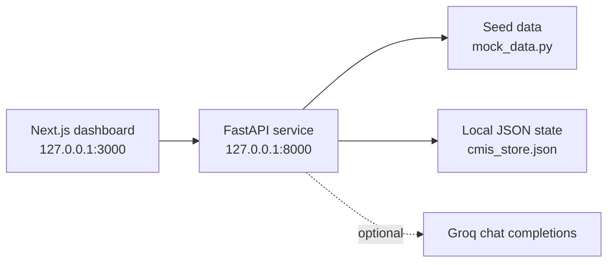

<div align="center">

# Campus Course Hub

**A local-first Course Management Information System prototype for campus transformation.**


[Quick Start](#quick-start) | [Role Tour](#role-tour) | [Architecture](#architecture) | [API](#api) | [Troubleshooting](#troubleshooting)

</div>

---

## Overview

Campus Course Hub is a professor-ready CMIS demo for an Organizational Transformation assignment. It connects student learning, course registration, faculty grading, registrar analytics, IT controls, certificates, audit trails, and optional AI assistance in one laptop-friendly app.

| What it proves | How it is shown |
| --- | --- |
| Academic operations can be connected | Shared FastAPI data layer with role-specific dashboards |
| Users need different views of the same system | Student, Teacher, Registrar, and IT Support workspaces |
| AI can support campus workflows safely | Groq-backed tutor and grading assistant with local fallbacks |
| A demo should work without cloud dependencies | Seeded records plus JSON persistence in `backend/data/cmis_store.json` |

## Highlights

- Role-based CMIS dashboard built with Next.js and Tailwind CSS.
- FastAPI backend with OpenAPI docs and `/api/v1/*` endpoints.
- Student study plan, enrollment, AI tutor, rewards, and certificate verification.
- Faculty class view, grading queue, AI feedback draft, and grade finalization.
- Registrar KPIs, adoption heatmap, process debt, approval route, and change plan.
- IT health view, capacity monitor, API inventory, privacy controls, and audit trail.
- Seeded campus data, local persistence, and safe fallback behavior when Groq is not configured.

## Quick Start

```bash
python3 -m venv .venv
source .venv/bin/activate
pip install -r backend/requirements.txt
npm install --prefix frontend
cp backend/.env.example backend/.env
./scripts/dev.sh
```

| Surface | URL |
| --- | --- |
| Web app | [http://127.0.0.1:3000](http://127.0.0.1:3000) |
| API docs | [http://127.0.0.1:8000/docs](http://127.0.0.1:8000/docs) |
| Health check | [http://127.0.0.1:8000/health](http://127.0.0.1:8000/health) |

Stop both local servers:

```bash
./scripts/stop-local.sh
```

## Role Tour

| Workspace | Use it to show | Signature flow |
| --- | --- | --- |
| Student | Progress, registration, course help, badges, certificates | Ask the tutor a grade or course question |
| Teacher | Classes, submissions, rubric feedback, curriculum gaps | Generate an AI grading suggestion and save feedback |
| Registrar | KPIs, adoption, workflow delays, approval risk | Review process debt and record an action |
| IT Support | Service health, free-tier limits, privacy, auditability | Check endpoints and inspect audit history |

## Architecture



| Layer | Stack |
| --- | --- |
| Frontend | Next.js 14, React 18, TypeScript, Tailwind CSS, Recharts, lucide-react |
| Backend | FastAPI, Uvicorn, Pydantic, httpx, python-dotenv |
| AI | Groq chat completions when configured, local fallback otherwise |
| Persistence | Seed module plus local JSON store |

## Project Map

```text
.
|-- backend/
|   |-- app/main.py                 # FastAPI routes
|   |-- app/config.py               # Environment settings
|   |-- app/data/mock_data.py       # Seed data and persistence helpers
|   |-- app/services/groq_client.py # Optional AI client
|   `-- data/cmis_store.json        # Mutable local demo state
|-- frontend/
|   |-- src/app/page.tsx            # Role-based dashboard
|   |-- src/lib/api.ts              # API client and shared types
|   `-- package.json
|-- scripts/
|   |-- dev.sh                      # Start backend and frontend
|   `-- stop-local.sh               # Stop local servers
|-- MIS_Report_Output/              # Report, diagrams, screenshots, renders
`-- CMIS_PRD_v1.0.docx              # Product requirements document
```

## Configuration

`backend/.env`:

```bash
FRONTEND_ORIGINS=http://localhost:3000,http://127.0.0.1:3000
GROQ_API_KEY=
GROQ_MODEL=llama-3.1-8b-instant
```

Useful environment variables:

| Variable | Purpose |
| --- | --- |
| `GROQ_API_KEY` | Enables live AI tutor and grading responses |
| `GROQ_MODEL` | Selects the Groq model |
| `FRONTEND_ORIGINS` | CORS allowlist for local frontend URLs |
| `CMIS_DATA_FILE` | Overrides the backend JSON persistence file |
| `NEXT_PUBLIC_API_URL` | Points the frontend to a different API base URL |

## Commands

```bash
# Backend only
source .venv/bin/activate
uvicorn backend.app.main:app --reload --host 0.0.0.0 --port 8000

# Frontend only
npm run dev --prefix frontend -- --hostname 0.0.0.0 --port 3000

# Frontend checks/builds
npm run typecheck --prefix frontend
npm run build --prefix frontend
```

## Data and AI

Seeded campus records live in `backend/app/data/mock_data.py`. User actions such as enrollments, grades, workflow actions, chat history, and certificate verification persist to `backend/data/cmis_store.json`.

The AI tutor and grading assistant send only scoped CMIS context to Groq. If `GROQ_API_KEY` is missing or the network/API fails, the backend returns deterministic local guidance so the demo still works.

## API

The API prefix is `/api/v1`; full interactive docs are available at `/docs`.

<details>
<summary>Endpoint groups</summary>

| Group | Endpoints |
| --- | --- |
| System | `GET /health`, `GET /api/v1/overview`, `GET /api/v1/search`, `GET /api/v1/users/me` |
| Courses | `GET /api/v1/courses`, `POST /api/v1/enrollments` |
| Student | `GET /student/{student_id}/study-plan`, `GET /student/{student_id}/course-registration`, `GET /student/{student_id}/certificates`, `POST /chat/{course_id}/message`, `POST /certificates/verify/{certificate_hash}` |
| Faculty | `GET /faculty/{faculty_id}/classes`, `GET /faculty/{faculty_id}/grading-queue`, `GET /faculty/course-improvements`, `POST /grading/suggest`, `PATCH /submissions/{submission_id}/grade` |
| Registrar | `GET /admin/campus-kpis`, `GET /admin/departments-needing-help`, `GET /admin/workflow-delays`, `POST /admin/workflow-actions`, `GET /admin/approval-route` |
| IT | `GET /it/system-health`, `GET /it/dependency-map`, `GET /it/capacity-monitor`, `GET /it/api-surface`, `GET /it/privacy-controls`, `GET /it/audit-trail` |

</details>

## Troubleshooting

| Problem | Fix |
| --- | --- |
| Frontend cannot reach the API | Confirm `curl http://127.0.0.1:8000/health`, then set `NEXT_PUBLIC_API_URL` if needed |
| AI shows local guidance | Add `GROQ_API_KEY` to `backend/.env` and restart the backend |
| Ports are already in use | Run `./scripts/stop-local.sh` before starting again |
| Demo state changed | Stop the backend and reset `backend/data/cmis_store.json` |

---

<div align="center">

Built for a concise, reliable CMIS demonstration: start locally, switch roles, show transformation value.

</div>
